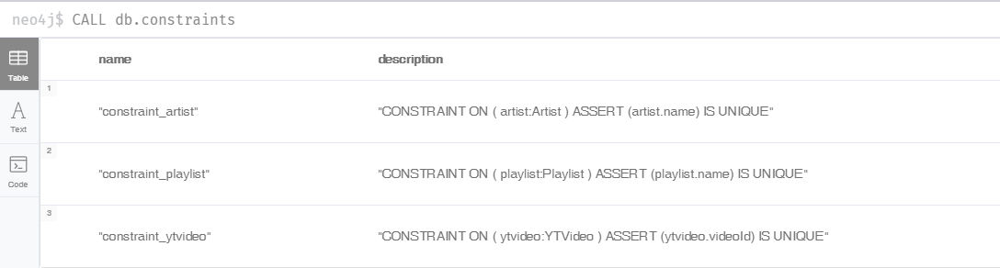
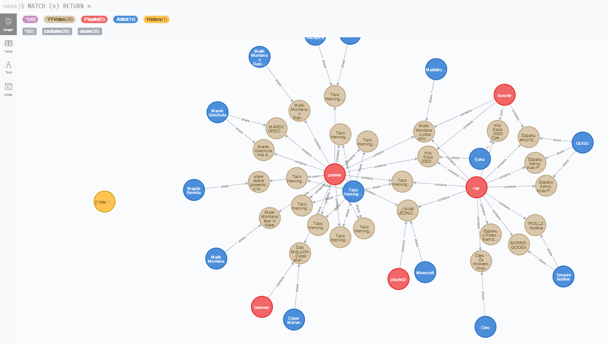

# MySpotify
Biblioteka/odtwarzacz muzyki zrealizowany za pomocą angulara(frontend), grafowej bazy danych neo4j, node js, express js(backend) oraz api youtube(Youtube Api data v3 oraz YT iframe api)  
link(jesli przez jakis czas jest nie uzywany, trzeba zaczekac az odapli się server oraz baza danych, około 30sec i odświweżyc stronę, ponieważ automatycznie się wyłącza): https://myspotify-app.herokuapp.com 
wykonał: Szymon Zieliński  

## 1.Backend
kod znajduje sie w folderze 'server', server można odpalić za pomocą komendy 'node .\server\server.js'.
## 2.Frontend 
przed odpaleniem servera należy zbudować projekt za pomocą komendy 'ng build --prod' co spowoduje powstanie plikow wynikowych w folderze dist, z ktorych bedzie korzystał server.
## 3.Baza danych
### Nodes & relations:
Węzły w bazie:  
- YTVideo - zawiera obiekt muzyki: tytuł, wykonawce, date dodania, ilosc wyswietlen, czas trwania, link do obrazka, videoID z którego tworzony jest link do muzyki, informacje czy jest polubiony(informacja ta jest na tyle często pobierana[przy kazdym wyswietleniu], że dałem ją bezpośrednio jako parametr muzyki, żeby nie trzeba było za każdym razem sprawdzac czy jest w polubionych w bazie).
- Artist - zawiera unikalną nazwę wykonawcy.
- History - zawiera liste ostatnio puszczanych muzyk.
- Playlist - zawiera unikalną nazwe playlisty (uwaga: w przypadku podzialu na uzytkownikow nalezy zmienic ustawienia bazy poniewarz nazwa playlisty bedzie unikalna tylko w ramach danego uzytkownika)  
Relacje w bazie:
- contains - relacja między playlistą a muzyka, oznacza, że dana muzyka znajduje się w playliście (ulubione utwory w bazie są zwykłą playlistą o nazwie favorite).
- share - relacja między wykonawcą a jego muzyką. Oznacza, że dany wykonawca wrzucił na youtubea daną muzyke. Ponieważ jest to nazwa kanału na YT często nie zgadza się z prawdziwym wykonawcą dlatego dodałem możliwość zmiany wykonawc z poziomu aplikacji.
### Tworzenie:
Po stwoirzeniu bazy danych neo4j a jeszcze przed uruchomieniem programu stworzyłem 3 constrainty

### Pliki:
reszta działań na bazie danych jest jest wykonywana w aplikacji, wszystkie komendy są w odpowiednich plikach w folderze 'server'. Pliki:
- addYTVideoToPlaylist.js obsluga metody post, dodaje Nody muzyki, playlisty do ktorej zostaje ona dodana oraz wykonawcy jeśli któryś nie istnieje. Następnie tworzy relacje między muzyką i playlistą oraz muzyką i wykonawcą.
- artist.js metoda get, zwraca liste piosenek należących do artysty o podanym imieniu i nazwisku
- artists.js zwraca liste wszystkich artystów z bazy
- changeArtist.js usuwa starego artyste przypisanego do muzyki, jesli ten artysta nie ma juz zadnych piosenek w relacji usuwa calego nodea artysty z bazy. Nastepnie tworzy nodea nowego artysty jesli nie istnial i tworzy relacje miedzy piosenka a nowym artysta. Słóży do ręcznej zmiany wykonawcy, ponieważ piosenki są zapisywane z Youtube przez co wykonawcy są nazwami kanału na YT co nie działa zbyt dobrze.
- deleteYTVideoFromPlaylist.js usuwa relacje miedzy piosenka a playlista
- getHistory.js zwraca liste ostatnio puszczanych piosenek
- setHistory.js aktualizuje historie w bazie
- playlist.js zwraca piosenki z playlisty o podanej nazwie
- playlists.js zwraca wszystkie playlisty z bazy
- setSong.js aktualizuje informacjhe o piosence o danym ID
- songPlaylist.js zwraca playlisty do ktorych nalezy podana piosenka
- songs.js zwraca wszystkie piosenki z bazy lub takie ktore maja w nazwie lub w wykonawcy podany fragment.
### Przykladowy stan bazy: 

This project was generated with [Angular CLI](https://github.com/angular/angular-cli) version 9.1.7.
## Development server
Run `ng serve` for a dev server. Navigate to `http://localhost:4200/`. The app will automatically reload if you change any of the source files.
## Build
Run `ng build` to build the project. The build artifacts will be stored in the `dist/` directory. Use the `--prod` flag for a production build.

## to do:
- przewijanie piosenek(pasek)
- naprawić puszczanie piosenek z playlisty automatycznie po sobie
- naprawić to że strasznie duzo w jednym komponencie(main-page component)
- zapisywanie muzyki MP3 w bazie (żeby działała offline)
- przekierowania, żeby nie dalo sie wejść na linki bezpośrednie do metod post/get
- zmiana kolejnosći playlist(przeciąganie, jako ostatnie)
- odtwarzanie w tle na telu (HTML5 audio api? JPlayer? tak jak np. na stronie: coffitivity.com)
- przenieść połączenia z api na backend
